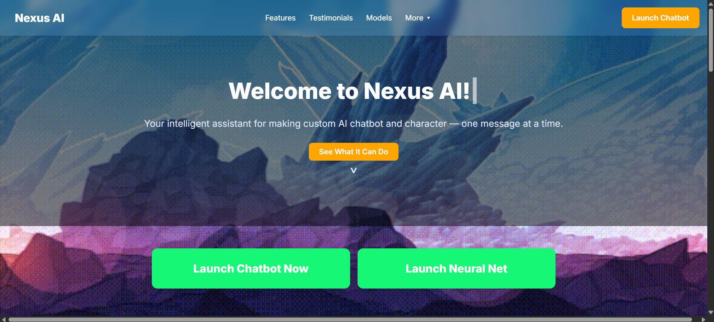
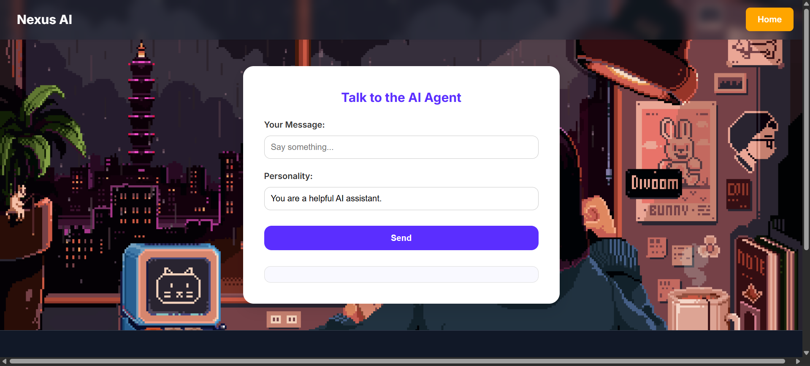
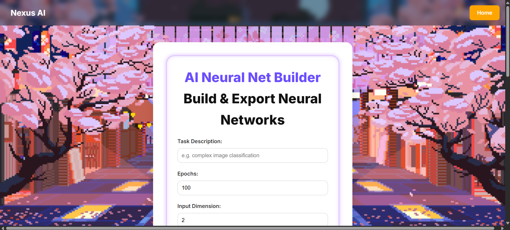
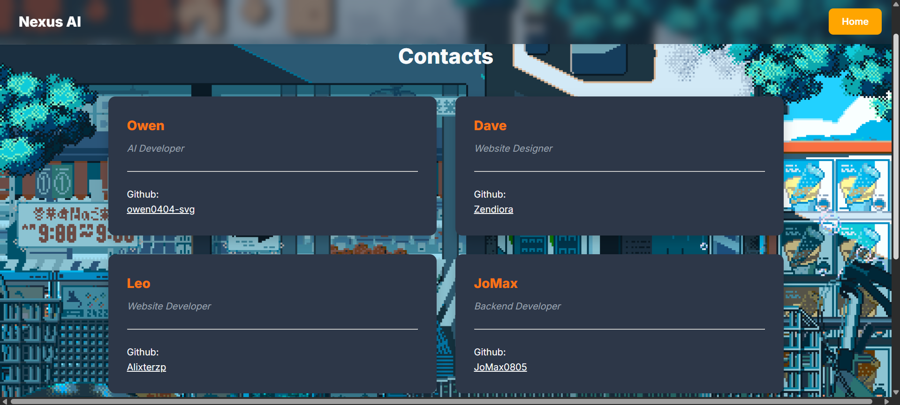

# 🧠 Nexus AI

Your intelligent assistant for making custom AI chatbot and character — one message at a time. Nexus AI 

---

## 📱 Overview

Welcome to Nexus AI, a free AI creator that anyone can use. Nexus AI features a ChatBot creator which is quick and responsive and also a easy to use Neural Network builder. This project showcases how our intelligent AI agent builder can be used by users to easily create custom chatbots and neural networks.

---

## ❗ Nexus AI Introduction

You can access the Introduction Presentation here:

🔗 [Introduction to Nexus AI](https://drive.google.com/file/d/15VX4U0Ab3zrX80sNkZdLg6MwdMerfv7-/view?usp=sharing)

---

## 🌐 Access the Live Demo

You can access the Live Demo here:

🔗 [Nexus AI](https://lp3jy-yqaaa-aaaai-q3xqa-cai.icp0.io/)

---

## 🚀 Features

- 🤖 AI Chatbot with natural language understanding

- 🧑🏻‍💻 Easy to use Neural Network builder

- 🌐 Responsive UI for all monitor sizes

- 🔓 Free to use for all users

- 🌐 Supported on web 3.0

- 🤖 Ran with decentralized AI

---

## 💻 Future Plans

- 🖼️ Nexus AI Image Generator

- 🔨 More sophisticated Neural Network builder

- 🌻 More personal and decentralized AI

---

## ❓ FAQ

**Q: Is it free to use?**

A: Yes, Nexus AI is free to use for any users.

**Q: What powers Nexus AI?**

A: HTML, CSS, and JS for frontend, Pytorch, SKLearn, and Ollama Mistral for AI tools, also Flask and Python for backend.

**Q: How do you use the Neural Network builder?**

A: You can see the how to use section below or see the [tutorial video](url.com).

---

## 🤖 Tech Stack

Frontend: HTML, CSS, and JavaScript

Backend: Flask and Python

AI Tools: Pytorch, SKLearn, and Ollama Mistral

Deployment: Internet Computer Protocol (ICP) and local

---

## 🤔 How to use

You can check the tutorial video here:

🔗 [Nexus AI tutorial video](https://youtu.be/oazxrj4yOfY?si=KYUMx6zDDDjjBWLN)

---

## 🔴 Demo Video

You can check the deployed version here:

🔗 [Nexus AI live demo video](https://youtu.be/7EkBTHwwPp8?si=pLQkmJvnYSrcpj2y)

---

## 👷🏻‍♂️ Developers

- Owen — AI Developer

- Dave — Website Designer

- Leo — Website Developer

- JoMax — Backend Developer

---

## 🔧 License

This project is licensed under the MIT License.
